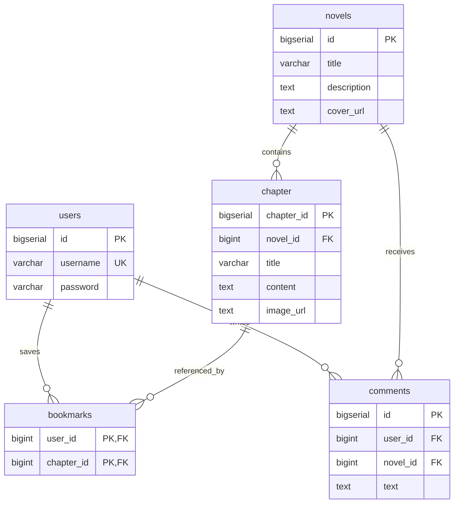

# 📖 NovelVerse

<p align="center">
  <b>Современная гибридная платформа (Web + Desktop) для чтения, каталогизации и обсуждения новелл и ранобэ.</b>
</p>

<p align="center">
  
  
  
  
  
</p>

---

## 📌 Оглавление
1. [Обзор проекта](#-обзор-проекта)
2. [Ключевой функционал](#-ключевой-функционал)
3. [Архитектура и принципы ООП](#-архитектура-и-принципы-ооп)
4. [Структура проекта](#-структура-проекта)
5. [Схема базы данных](#-схема-базы-данных)
6. [REST API Документация](#-rest-api-документация)
7. [Socket-чат (TCP Протокол)](#-socket-чат-tcp-протокол)
8. [Инструкция по запуску](#-инструкция-по-запуску)
9. [Сборка и дистрибуция](#-сборка-и-дистрибуция)
10. [Сценарий для демонстрации](#-сценарий-для-демонстрации)

---

## 🌟 Обзор проекта

**NovelVerse** — это комплексный проект, объединяющий современный веб-сервис и нативное десктопное приложение:
- **Web-режим**: REST API на `Spring Boot`, слой данных на `JDBC` + `PostgreSQL`, стилизованный адаптивный фронтенд (`Tailwind CSS`, `Lucide Icons`).
- **Desktop-режим**: Автономное приложение на `JavaFX` с встроенным `WebView` и выделенной вкладкой многопоточного TCP Socket-чата.
- **Работа с документами**: Парсинг загруженных PDF-файлов с автоматическим разделением на главы и экспорт глав обратно в PDF (`Apache PDFBox`).

---

## ✨ Ключевой функционал

- 📖 **Каталог произведений**: просмотр списка новелл с обложками, описаниями и счетчиком глав.
- 📑 **Интерактивная читалка**: удобное чтение глав с поддержкой иллюстраций, навигацией между главами и сохранением прогресса.
- ⭐ **Система закладок**: добавление глав в персональный список для быстрого доступа из профиля.
- 💬 **Комментарии и обсуждения**: отзывы пользователей к произведениям.
- 👤 **Аутентификация**: регистрация и авторизация пользователей.
- 📄 **Импорт и Экспорт PDF**:
  - Асинхронный импорт книг из PDF с авторазделением текста на главы в фоне.
  - Экспорт любой главы книги в файл PDF с кроссплатформенным форматированием шрифтов.
- ⚡ **TCP Socket Чат**: сервер на сырых сокетах (порт `9090`) с поддержкой смены ников (`/name`), широковещательной рассылки и системных оповещений.
- 🖥️ **Десктопный клиент**: современный интерфейс без стандартных системных рамок (undecorated window) с кастомной панелью управления.
- 🛠️ **Панель управления (Admin)**: создание, редактирование и удаление новелл и глав.

---

## 🏛 Архитектура и принципы ООП

Архитектура построена по классической многоуровневой схеме (Layered Architecture):

```
[ Frontend (HTML/JS) / JavaFX WebView ]
                  │ (HTTP / JSON)
                  ▼
          [ Controller Layer ]  ───────►  [ Global Exception Handler ]
                  │
                  ▼
           [ Service Layer ]    ───────►  [ PDFBox / ExecutorService ]
                  │
                  ▼
         [ Repository Layer ]   (JDBC / PreparedStatement / Connection Pool)
                  │
                  ▼
        [ PostgreSQL Database ]
```

### Применение принципов ООП:
- **Абстракция**: Абстрактный базовый класс [`Content`](src/main/java/com/novelverse/novelverse/domain/Content.java) инкапсулирует общие свойства текстового контента.
- **Наследование**: Классы [`Novel`](src/main/java/com/novelverse/novelverse/domain/Novel.java) и [`Chapter`](src/main/java/com/novelverse/novelverse/domain/Chapter.java) наследуются от `Content`.
- **Интерфейсы и Полиморфизм**:
  - Интерфейс [`Readable`](src/main/java/com/novelverse/novelverse/domain/Readable.java) реализуется сущностями, доступными для чтения.
  - Интерфейсы репозиториев (`NovelRepository`, `ChapterRepository`, `UserRepository`, `BookmarkRepository`, `CommentRepository`) изолируют логику персистентности от бизнес-логики.
- **Инкапсуляция**: Все поля доменных сущностей защищены и доступны через геттеры и сеттеры; DTO используются для валидации и передачи данных.
- **Многопоточность**: 
  - `ExecutorService` (FixedThreadPool) для асинхронной обработки фоновых задач (парсинг PDF, входящие подключения TCP-сокетов).
  - Потокобезопасная коллекция `ConcurrentHashMap.newKeySet()` в `ChatServer` для управления подключенными клиентами.

---

## 📂 Структура проекта

```
NovelVerse/
├── .mvn/wrapper/                  # Maven Wrapper
├── dist/                          # Собранные десктопные дистрибутивы (jpackage)
├── src/
│   ├── main/
│   │   ├── java/com/novelverse/novelverse/
│   │   │   ├── config/            # Spring и инфраструктурные конфигурации
│   │   │   │   ├── ChatServerStartup.java
│   │   │   │   ├── DbConfig.java
│   │   │   │   └── ExecutorConfig.java
│   │   │   ├── controller/        # REST API контроллеры
│   │   │   │   ├── AuthController.java
│   │   │   │   ├── BookmarkController.java
│   │   │   │   ├── ChapterController.java
│   │   │   │   ├── CommentController.java
│   │   │   │   ├── GlobalExceptionHandler.java
│   │   │   │   ├── NovelController.java
│   │   │   │   └── PdfController.java
│   │   │   ├── desktop/           # Десктопный JavaFX-клиент и встроенный прокси
│   │   │   │   ├── DesktopSocketChatClient.java
│   │   │   │   ├── DesktopWebProxyServer.java
│   │   │   │   ├── NovelVerseDesktopApp.java
│   │   │   │   └── NovelVerseDesktopLauncher.java
│   │   │   ├── domain/            # Доменные модели (ООП сущности)
│   │   │   │   ├── Bookmark.java
│   │   │   │   ├── Chapter.java
│   │   │   │   ├── Comment.java
│   │   │   │   ├── Content.java
│   │   │   │   ├── Novel.java
│   │   │   │   ├── Readable.java
│   │   │   │   └── User.java
│   │   │   ├── dto/               # Data Transfer Objects
│   │   │   ├── repository/        # Интерфейсы и JDBC-реализации репозиториев
│   │   │   │   ├── impl/
│   │   │   │   │   ├── BookmarkRepositoryImpl.java
│   │   │   │   │   ├── ChapterRepositoryImpl.java
│   │   │   │   │   ├── CommentRepositoryImpl.java
│   │   │   │   │   ├── NovelRepositoryImpl.java
│   │   │   │   │   └── UserRepositoryImpl.java
│   │   │   ├── service/           # Сервисный слой бизнес-логики
│   │   │   │   ├── BookmarkService.java
│   │   │   │   ├── ChapterService.java
│   │   │   │   ├── CommentService.java
│   │   │   │   ├── NovelService.java
│   │   │   │   ├── PdfService.java
│   │   │   │   └── UserService.java
│   │   │   ├── socket/            # TCP Socket сервер чата
│   │   │   │   ├── ChatServer.java
│   │   │   │   └── ClientHandler.java
│   │   │   └── NovelverseApplication.java
│   │   └── resources/
│   │       ├── application.properties
│   │       ├── schema.sql         # SQL DDL скрипт инициализации БД
│   │       └── static/            # Frontend страницы (HTML/CSS/JS)
│   │           ├── admin.html
│   │           ├── index.html
│   │           ├── login.html
│   │           ├── novel.html
│   │           ├── profile.html
│   │           ├── read.html
│   │           └── register.html
│   └── test/                      # Модульные тесты
├── build-desktop-exe.bat          # Скрипт сборки Windows EXE
├── build-desktop-image.bat        # Скрипт сборки App-Image (jpackage)
├── docker-compose.yaml            # Развертывание PostgreSQL в Docker
├── launch-desktop.bat             # Быстрый запуск десктопа (Windows)
├── launch-desktop.sh              # Быстрый запуск десктопа (Linux/macOS)
├── mvnw / mvnw.cmd                # Исполняемые файлы Maven Wrapper
└── pom.xml                        # Конфигурация Maven зависимостей и плагинов
```

---

## 🗄 Схема базы данных



---

## 📡 REST API Документация

### Аутентификация (`/auth`)
| Метод | Эндпоинт | Описание | Тело запроса | Ответ |
|---|---|---|---|---|
| `POST` | `/auth/register` | Регистрация нового пользователя | `{"username": "...", "password": "..."}` | `{"id": 1, "username": "..."}` |
| `POST` | `/auth/login` | Вход пользователя | `{"username": "...", "password": "..."}` | `{"id": 1, "username": "..."}` |

### Новеллы (`/novels`)
| Метод | Эндпоинт | Описание | Тело запроса | Ответ |
|---|---|---|---|---|
| `GET` | `/novels` | Получить все новеллы | — | `[ { "id": 1, "title": "...", ... } ]` |
| `GET` | `/novels/{id}` | Получить новеллу по ID | — | `{ "id": 1, "title": "...", ... }` |
| `POST` | `/novels` | Создать новеллу | `{"title": "...", "description": "...", "coverUrl": "..."}` | `200 OK` |
| `PUT` | `/novels/{id}` | Обновить новеллу | `{"title": "...", "description": "...", "coverUrl": "..."}` | `200 OK` |
| `DELETE` | `/novels/{id}` | Удалить новеллу | — | `200 OK` |

### Главы (`/chapters`)
| Метод | Эндпоинт | Описание | Тело запроса | Ответ |
|---|---|---|---|---|
| `GET` | `/chapters/novel/{id}` | Список глав новеллы | — | `[ { "id": 1, "novelId": 1, ... } ]` |
| `GET` | `/chapters/{id}` | Получить главу по ID | — | `{ "id": 1, "title": "...", "content": "..." }` |
| `POST` | `/chapters` | Создать главу | `{"novelId": 1, "title": "...", "content": "...", "imageUrl": "..."}` | `200 OK` |
| `PUT` | `/chapters/{id}` | Обновить главу | `{"title": "...", "content": "...", "imageUrl": "..."}` | `200 OK` |
| `DELETE` | `/chapters/{id}` | Удалить главу | — | `200 OK` |

### Закладки (`/bookmarks`)
| Метод | Эндпоинт | Описание | Тело запроса | Ответ |
|---|---|---|---|---|
| `GET` | `/bookmarks/{userId}` | Получить закладки пользователя | — | `[ { "userId": 1, "chapterId": 5 } ]` |
| `POST` | `/bookmarks` | Добавить закладку | `{"userId": 1, "chapterId": 5}` | `200 OK` |
| `DELETE` | `/bookmarks` | Удалить закладку | `{"userId": 1, "chapterId": 5}` | `200 OK` |

### Комментарии (`/comments`)
| Метод | Эндпоинт | Описание | Тело запроса | Ответ |
|---|---|---|---|---|
| `GET` | `/comments/novel/{id}` | Комментарии к новелле | — | `[ { "id": 1, "userId": 1, "text": "..." } ]` |
| `POST` | `/comments` | Добавить комментарий | `{"userId": 1, "novelId": 1, "text": "..."}` | `200 OK` |

### PDF Документы (`/pdf`)
| Метод | Эндпоинт | Описание | Параметры | Ответ |
|---|---|---|---|---|
| `POST` | `/pdf/upload` | Загрузить PDF и разбить на главы | `file` (Multipart), `novelId` (Long) | `200 OK` |
| `GET` | `/pdf/chapter/{id}` | Скачать главу в виде PDF | `id` (Long в пути) | `application/pdf` (файл) |

---

## 💬 Socket-чат (TCP Протокол)

В проекте реализован сетевой чат реального времени на основе `java.net.ServerSocket` (порт `9090`).

- **Подключение**: клиент устанавливает TCP-соединение на `127.0.0.1:9090`.
- **Смена имени**: отправка строки `/name <НовоеИмя>` изменяет никнейм и рассылает системное уведомление.
- **Сообщения**: отправленный текст транслируется всем активным участникам в формате `[Имя] Сообщение`.
- **Системные события**: автоматические оповещения при подключении/отключении участников `[System] Guest-... joined/left the chat`.

---

## 🚀 Инструкция по запуску

### 1. Требования к окружению
- **Java JDK**: 17 или выше
- **Docker** и **Docker Compose** (для запуска PostgreSQL)
- **Maven**: 3.8+ (или использование встроенного скрипта `./mvnw`)

---

### 2. Запуск базы данных
В корне проекта выполните:
```bash
docker compose up -d
```
> Контейнер PostgreSQL поднимется на порту `5432` с базой `novel_db` (логин: `admin`, пароль: `1234`). Скрипт `schema.sql` инициализирует таблицы автоматически при старте приложения.

---

### 3. Запуск в режиме Web-приложения
Запустите Spring Boot бэкенд:

**Linux / macOS**:
```bash
./mvnw spring-boot:run
```

**Windows**:
```bat
mvnw.cmd spring-boot:run
```

После старта откройте в браузере:  
👉 **[http://localhost:8080](http://localhost:8080)**

---

### 4. Запуск в режиме Desktop-приложения (JavaFX)
Десктопное приложение поднимает бэкенд и socket-сервер автоматически и открывает интерфейс в нативном окне.

**Быстрый запуск**:
- **Windows**: Двойной клик по [`launch-desktop.bat`](launch-desktop.bat)
- **Linux / macOS**: Выполнить [`./launch-desktop.sh`](launch-desktop.sh)

**Или через Maven**:
```bash
./mvnw javafx:run
```

---

## 📦 Сборка и дистрибуция

Для демонстрации или создания нативного установщика предусмотрены готовые скрипты с использованием `jpackage`:

1. **Создание портативного App-Image** (папка `dist/NovelVerseDesktop`):
   ```bat
   build-desktop-image.bat
   ```
2. **Создание Windows `.exe` инсталлятора**:
   ```bat
   build-desktop-exe.bat
   ```

Подробные инструкции по сборке описаны в [DESKTOP_RUN.md](DESKTOP_RUN.md).

---

## 🎬 Сценарий для демонстрации

1. Запустить десктопное приложение (`launch-desktop.bat` / `./launch-desktop.sh`).
2. Ознакомиться с каталогом новелл на главной странице.
3. Перейти в раздел **Вход / Регистрация** и создать учетную запись.
4. Открыть вкладку **Управление (Admin)**, создать новую новеллу и добавить к ней главу.
5. Протестировать **Импорт PDF**: загрузить PDF-файл в новеллу и убедиться, что он автоматически разбился на главы в фоне.
6. Открыть читалку, добавить понравившуюся главу в **Закладки** и проверить ее наличие в **Профиле**.
7. Нажать **Скачать в PDF** и просмотреть экспортированный PDF-документ.
8. Переключиться на вкладку **Socket Chat**, задать имя и протестировать обмен сообщениями по сокету в реальном времени.

---

<p align="center">
  Разработано с ❤️ командой NovelVerse.
</p>
